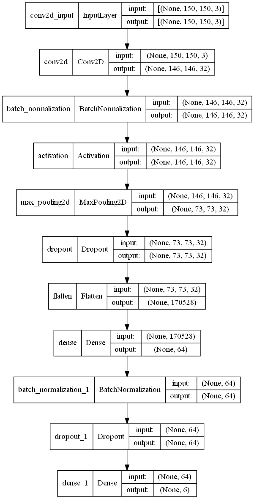
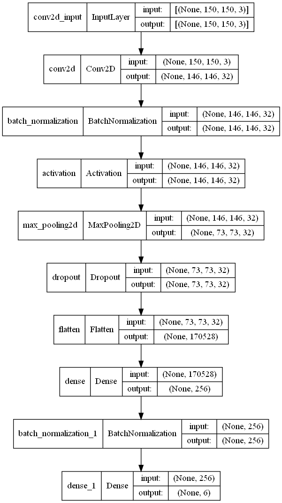
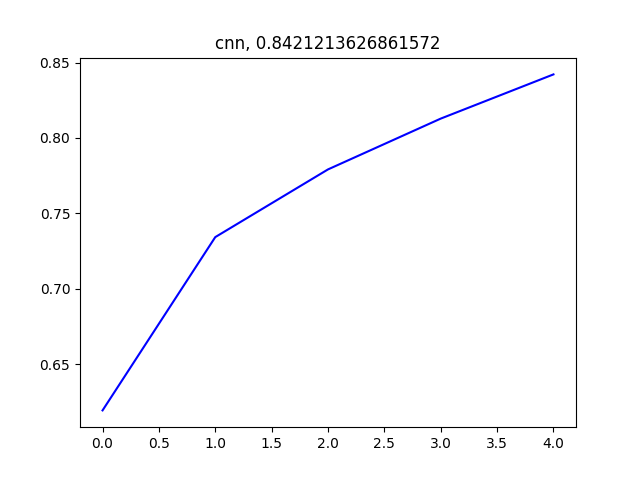
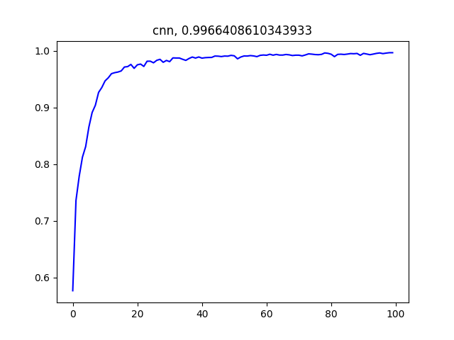
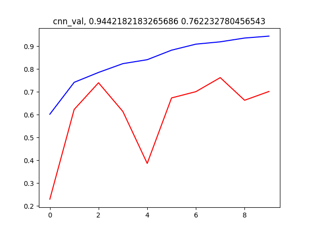
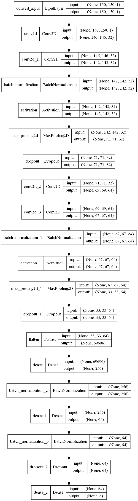
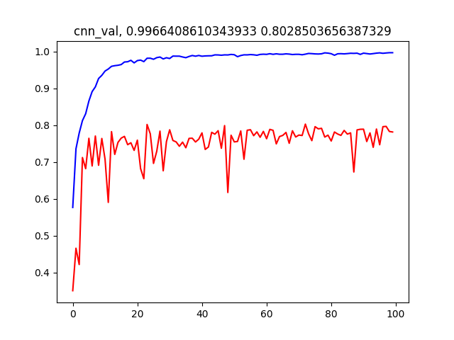
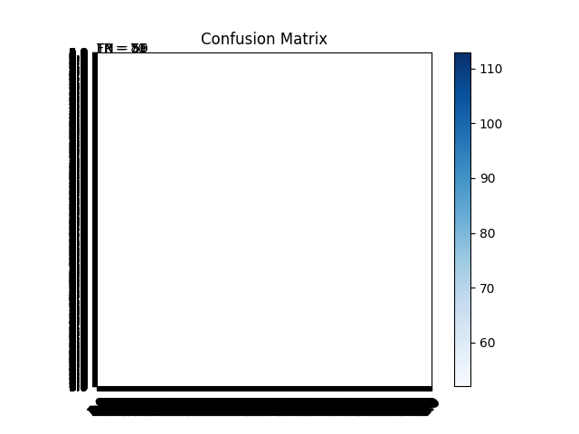

# Q1. Summary
For this project I tried a classification problem for the images. I have used ConvNet (Convolutional Neural Network) as my model. Though, I have been trying to modify it to get more accuracy on the test data or say real word data. The results I got on each step during this process are discussed in the details.

- Basic CNN, works better than the other models like ANNs.

- From basic to complex CNN, performance improvement is there. By adding some more conv layers, max-pooling layers affects the result with better accuracy.

- More *epochs* indeed give better accuracy. But after a point, adding number of epochs doesn't improve the performance that much. `30` epochs I found is giving me as good results as say `50` or `100` epochs.

- Saving the model with learned weights, and only architecture both ways. With learned weights, I can use that model directly on the other dataset with same classification problem, given that both have same numbers of class. For this, I can actually Dense layer, and put the new Dense layer for the new classification problem. This technique is called `transformed learning`. I am running the code for this by the submission time. I will put the results if I am able to do it correctly on the other dataset. Otherwise, model is saved with learned weights in `output folders`. The other technique is just saving the `architecture` of model, so for other problems, I don't need to write from scratch, I can use this, but I have to train the model again to learn the weights for the new problem.

---

# Q2. Dataset Description

I have chosen the [intel image classification dataset][1] from the [kaggle website][2].

According to their website, this dataset contains the image data of Natural Scenes around the world. The dataset has *25,000 images* of size *150x150* of *6 different categories*.

The Categories in the dataset are as follows.
- buildings
- forests
- glacier
- mountain
- sea
- street

The training, testing, and prediction data are already separated in their own directory. This has separate prediction directory because it was used to held some image classification challenge as we had for our assignment3 *mnist dataset* with *best ConvNet* that we can build to minimize the error or say maximize accuracy.

Since for the prediction, I won't have labels, I am going to use the test data as held out set for the validation purpose (which I wouldn't use in training). The details of methods and results is discussed in the next segment.

---

## AUC Values:

I didn't know how to do this part for images, and the pdf document for project said that it is not required should we choose dataset that uses some images. But TA Jueqi have emailed some idea how to do it.

I have tired to write code to generate the AUC curve, as per Jueqi's email instruction. I have tried my best to come up with the answer, but it shows me some errors that I am unable to debug, regarding multi-class classification, sum should be 1 and my y_prediction values (features) are continuous variable from the images, which somehow doesn't sum up to 1 according to probability distribution.

The code is there in `get_ACU()` function of `helpers.py` file.

---

# Q3 Details

## Preprocessing the dataset
The dataset was a *zip* file containing all 3 folders (training, testing, validation) containing images, out of which in the training, and testing folders there were sub folders in which images already are classified. That would be ground-truth labels for each of the images. As I mentioned above, this dataset was used for some competition, so it has a separate validation dataset without labels. I can do prediction for that and give the result what the labels should be for each of the images, but TA/Prof may not have the ground truth for correctness like *mnist dataset for assignment3*. Hence, I am not using that sub folder. I will use that testing folder as hold out testing dataset, which I would not use while training. The main part I have to do in this is unzip the file. After which I found that each folder were nested inside the folder with the same name. For just sake of simplicity, I moved images out of that nested folder in to the original folder for each sub folder as I have seen in this [deeplizard][3] video of the playlist.

## Read the dataset
I used [keras build-in functionality][4] to get the images and labels in the correct format from the directory itself. It will give everything in proper format for the ConvNet at least. The parameters I had to choose was the image-size which was already given in the description of the dataset. So I hardcoded that value `image_size = (150, 150)`. For the batch size, I tried to experiment with different values. Trying on bigger values than default, I was running into some warning/errors related to GPU memory issue. I already had hard time with all this GPU problems for some reasons. So in the end, I decided to leave it do the default batch size and I am not tweaking it, not at least for the reading purpose. After reading both training, and testing datasets, I have proper structure to build my first model. The reading is done in the `helpers.py` file which is under `src` directory. That helper file have some other function that helps for different parts of the code.

## Build, Train, Test, Results

- Firstly, I tried to use a **basic CNN** similar to LeNet, with some modifications on the top of it directly on the training dataset given. The model is as shown in the figure (generated using Keras).  Running for epochs `1` got me `0.6419` training accuracy and `0.3130` testing accuracy. Since I am going to build revised the model step by step, putting all the results in the table at the end by model.

  - Few changes in the model with `5` epochs this time. To see number of epochs effects the results. This model, I have increased feature maps available at dense layer, just before last fully connected layer. The model is architecture is as following image. Since I am doing it for a number of epoc, I am able to generate some plot for that accuracy. The code for plotting is in `helpers.py` `plot` function.

|model|accuracy|
|---|---|
|||

- After that I tried to do with providing validation data within the fit function itself, to see, how the performance defers. Doing it for `5` epochs with basic model improved test accuracy significantly. There are some ups and down in the validation accuracy in the plot. Because I am trying to drop some layers, to order to prevent the overfitting issue. That is why after dropping layers, it may drop some learned weights randomly and maybe some important weights it learned are dropped.
  

- Trying to improve performance, I have tried to convert images into grayscale, and see, how it improves. But that didn't work as I intended it so, because I am getting so many errors regarding shape of the images. I rechecked, that I only have `1` color channel for gray scaled images, but I couldn't figure out how to fix the error.

- To improve some more, I have added rescaling layer, later will be wanting to add data augmentation layer (not now). Running it through some epochs, I get the results as follows. 

- Adding some more conv2D layers, and checking with `50` epochs. Now, training accuracy is 0.9932, but testing accuracy hasn't improved that significantly.

- Running for `100` epochs the same models, give almost similar results. Number of epochs doesn't matter after a point. So I need to change something else and see if I can improve the test accuracy.

|model|accuracy|
|---|---|
|||

- In addition, I tried to use that dataset without labels for predictions. I have tried to plot few images with their possible correct predictions. Code for that is in `main.py` file.

- I have tried to plot the confusion matrix. Code for that is in `main.py` file, Results is in `fig/performance` folder. This plot didn't come out as I wanted it to be. I missed something here when plotting. 

| model | cross_validation | epochs | train acc | test acc |
|---|---|---|---|---|
| basic_cnn | False | 1 | 0.6419 | 0.3130 |
| basic_cnn | False | 30 | 0.9955 | 0.4530 |
| basic_cnn | True  | 5 | 0.8421 | 0.7264 |
| cnn       | True  | 50 | 0.9932 | 0.8002 |
| cnn       | True  | 100 | 0.9966 | 0.7967 |

---

# References

[1]: https://www.kaggle.com/puneet6060/intel-image-classification
[2]: https://www.kaggle.com/
[3]: https://www.youtube.com/watch?v=_L2uYfVV48I&list=PLZbbT5o_s2xrwRnXk_yCPtnqqo4_u2YGL&index=10
[4]: https://keras.io/examples/vision/image_classification_from_scratch/

Deeplizard youtube channel: [Deep learning](https://www.youtube.com/playlist?list=PLZbbT5o_s2xrwRnXk_yCPtnqqo4_u2YGL)
